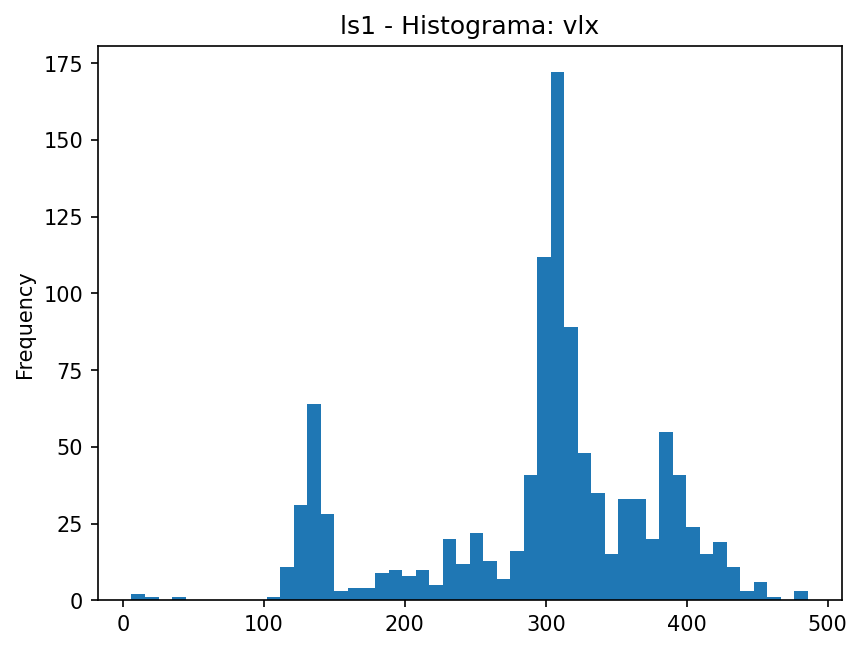
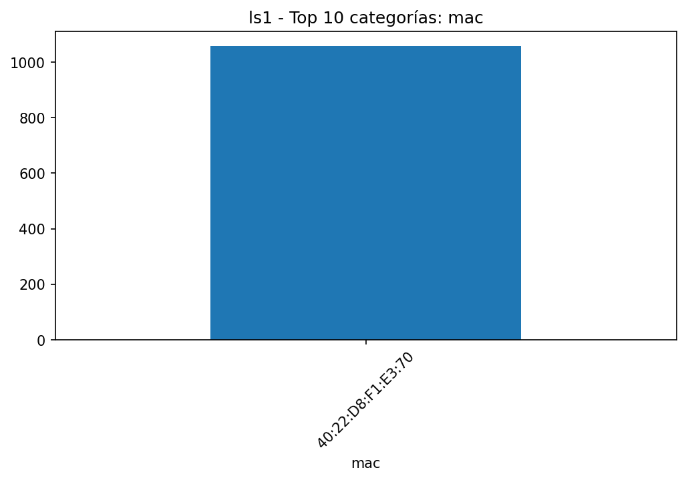
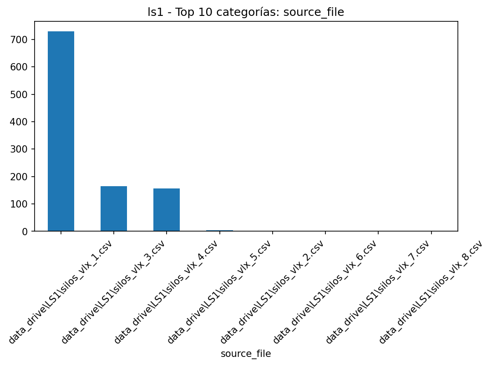
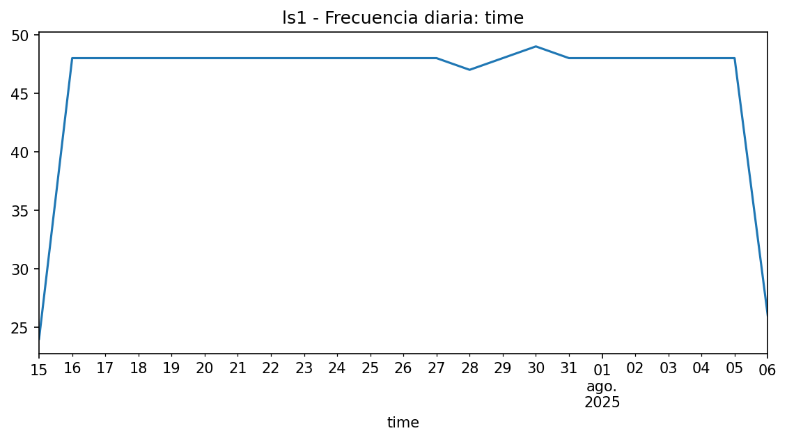

# EDA - ls1

## Resumen

- **Filas**: 1,058

- **Columnas**: 4

- **Memoria**: 167.51 KB (171,528 bytes)

- **Tipos de datos**: string: 2, datetime64[ns]: 1, Float64: 1

## Top columnas por % de nulos

|             |   nulls_pct |
|:------------|------------:|
| mac         |           0 |
| time        |           0 |
| vlx         |           0 |
| source_file |           0 |

## Top columnas por cardinalidad

|             |   unique_values |
|:------------|----------------:|
| time        |            1058 |
| vlx         |             265 |
| source_file |               8 |
| mac         |               1 |

## Resumen numérico extendido

|     |   count |    mean |     std |   min |   25% |   50% |   75% |   max |    skew |   kurtosis |   outliers_count |   outliers_pct |   low_fence |   high_fence |   iqr |
|:----|--------:|--------:|--------:|------:|------:|------:|------:|------:|--------:|-----------:|-----------------:|---------------:|------------:|-------------:|------:|
| vlx |    1058 | 296.716 | 83.9767 |     6 |   274 |   309 |   351 |   486 | -0.7476 |     0.0989 |              145 |        13.7051 |       158.5 |        466.5 |    77 |

## Gráficas

