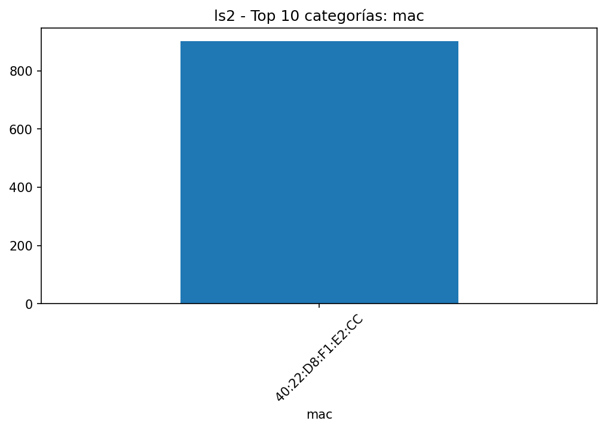

# EDA - ls2

## Resumen

- **Filas**: 902

- **Columnas**: 4

- **Memoria**: 142.83 KB (146,256 bytes)

- **Tipos de datos**: string: 2, datetime64[ns]: 1, Float64: 1

## Top columnas por % de nulos

|             |   nulls_pct |
|:------------|------------:|
| mac         |           0 |
| time        |           0 |
| vlx         |           0 |
| source_file |           0 |

## Top columnas por cardinalidad

|             |   unique_values |
|:------------|----------------:|
| time        |             902 |
| vlx         |             135 |
| source_file |               7 |
| mac         |               1 |

## Resumen numérico extendido

|     |   count |    mean |     std |   min |   25% |   50% |    75% |   max |   skew |   kurtosis |   outliers_count |   outliers_pct |   low_fence |   high_fence |    iqr |
|:----|--------:|--------:|--------:|------:|------:|------:|-------:|------:|-------:|-----------:|-----------------:|---------------:|------------:|-------------:|-------:|
| vlx |     902 | 101.595 | 140.633 |     1 |     1 |     1 | 258.75 |   423 | 0.7742 |    -1.1989 |                0 |              0 |    -385.625 |      645.375 | 257.75 |

## Gráficas

