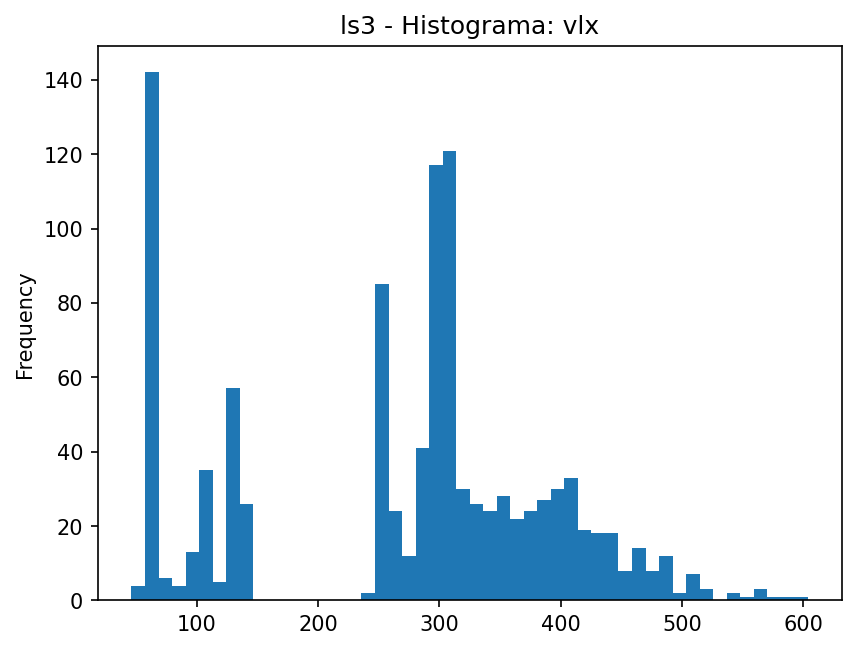
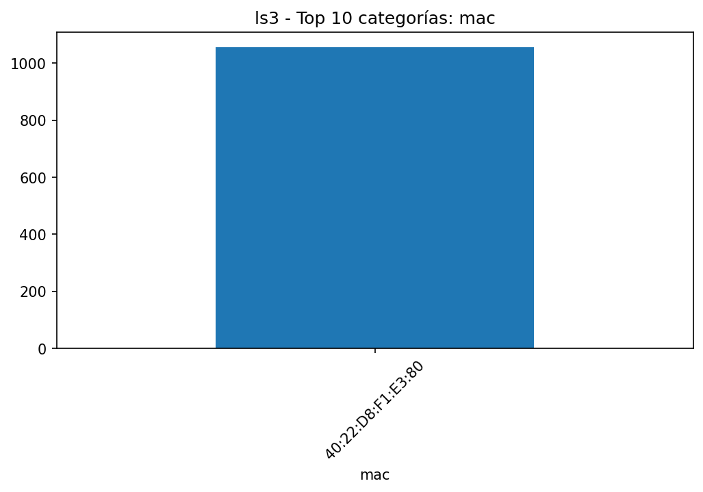
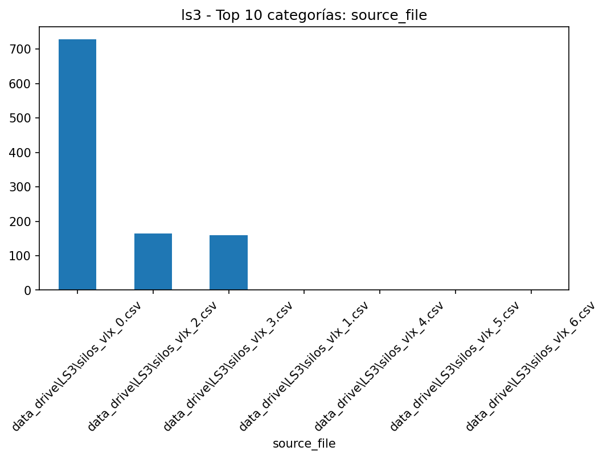
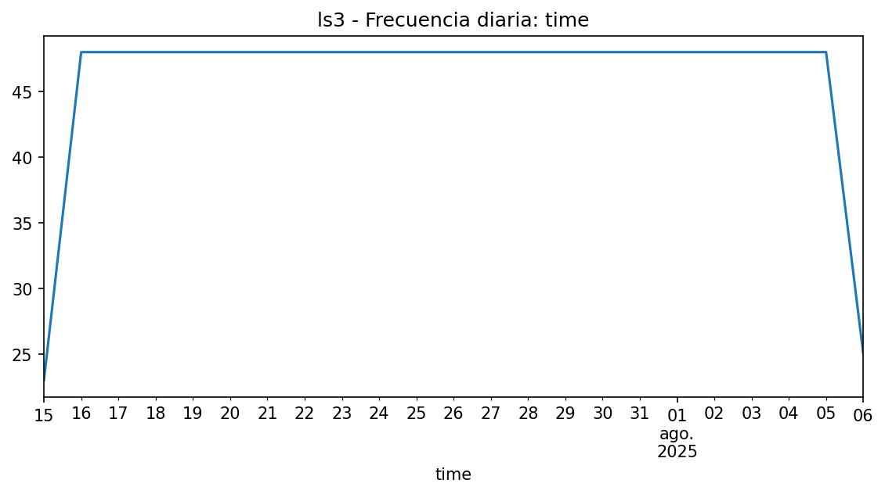

# EDA - ls3

## Resumen

- **Filas**: 1,056

- **Columnas**: 4

- **Memoria**: 167.19 KB (171,204 bytes)

- **Tipos de datos**: string: 2, datetime64[ns]: 1, Float64: 1

## Top columnas por % de nulos

|             |   nulls_pct |
|:------------|------------:|
| mac         |           0 |
| time        |           0 |
| vlx         |           0 |
| source_file |           0 |

## Top columnas por cardinalidad

|             |   unique_values |
|:------------|----------------:|
| time        |            1056 |
| vlx         |             293 |
| source_file |               7 |
| mac         |               1 |

## Resumen numérico extendido

|     |   count |    mean |    std |   min |   25% |   50% |   75% |   max |    skew |   kurtosis |   outliers_count |   outliers_pct |   low_fence |   high_fence |   iqr |
|:----|--------:|--------:|-------:|------:|------:|------:|------:|------:|--------:|-----------:|-----------------:|---------------:|------------:|-------------:|------:|
| vlx |    1056 | 270.351 | 126.89 |    46 |   135 |   299 |   353 |   604 | -0.2811 |    -0.7765 |                0 |              0 |        -192 |          680 |   218 |

## Gráficas

