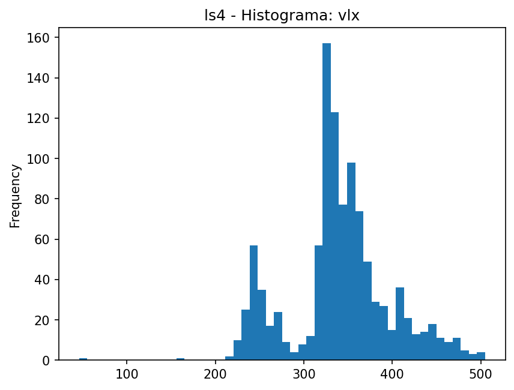
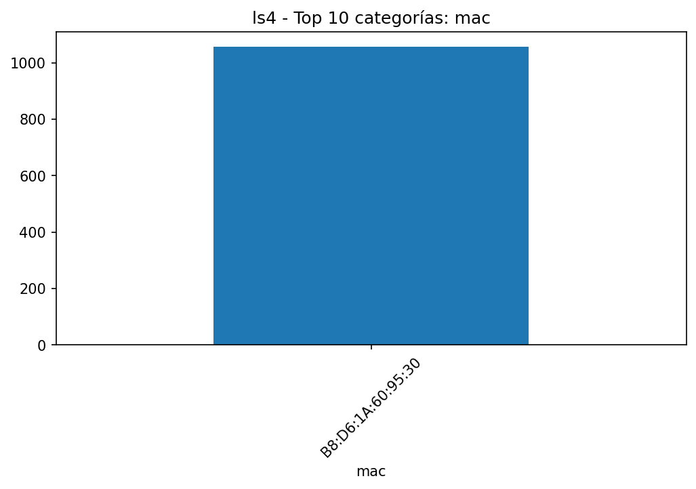
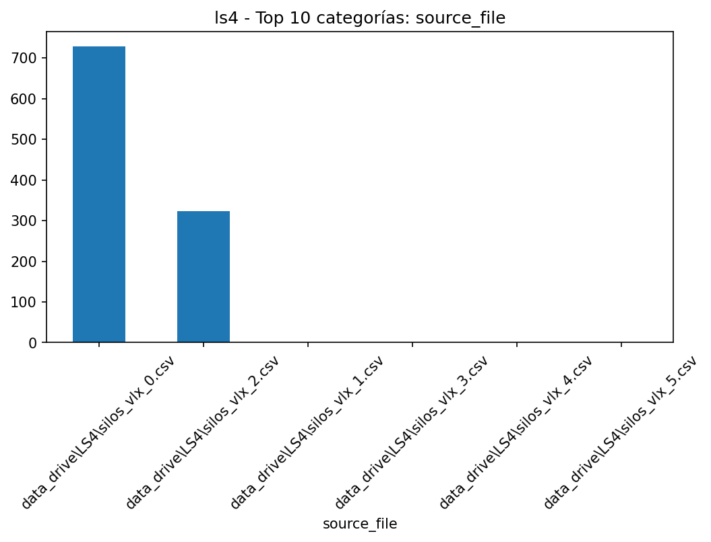
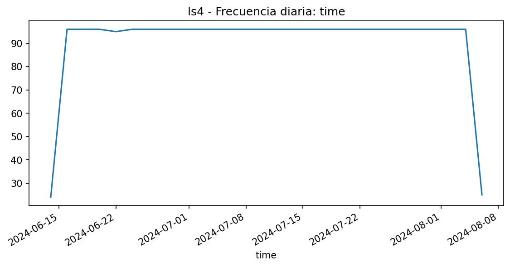

# EDA - ls4

## Resumen

- **Filas**: 1,056

- **Columnas**: 4

- **Memoria**: 167.19 KB (171,204 bytes)

- **Tipos de datos**: string: 2, datetime64[ns]: 1, Float64: 1

## Top columnas por % de nulos

|             |   nulls_pct |
|:------------|------------:|
| time        |       4.545 |
| mac         |       0     |
| vlx         |       0     |
| source_file |       0     |

## Top columnas por cardinalidad

|             |   unique_values |
|:------------|----------------:|
| vlx         |             229 |
| time        |             145 |
| source_file |               6 |
| mac         |               1 |

## Resumen numérico extendido

|     |   count |    mean |     std |   min |   25% |   50% |   75% |   max |    skew |   kurtosis |   outliers_count |   outliers_pct |   low_fence |   high_fence |   iqr |
|:----|--------:|--------:|--------:|------:|------:|------:|------:|------:|--------:|-----------:|-----------------:|---------------:|------------:|-------------:|------:|
| vlx |    1056 | 340.822 | 57.3394 |    46 |   322 |   338 |   368 |   505 | -0.0363 |     0.7372 |              183 |        17.3295 |         253 |          437 |    46 |

## Gráficas

