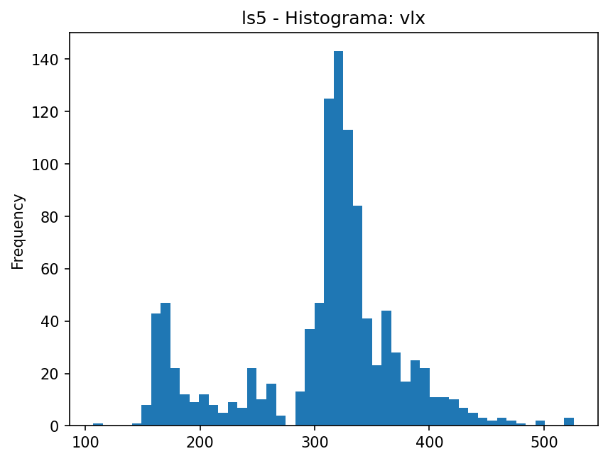
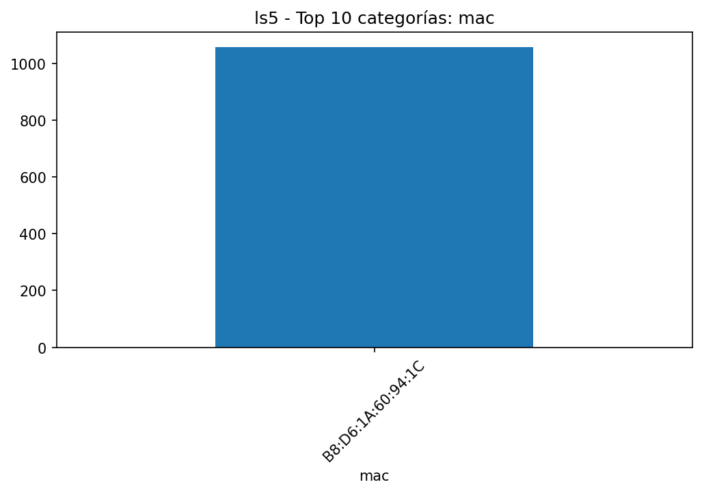
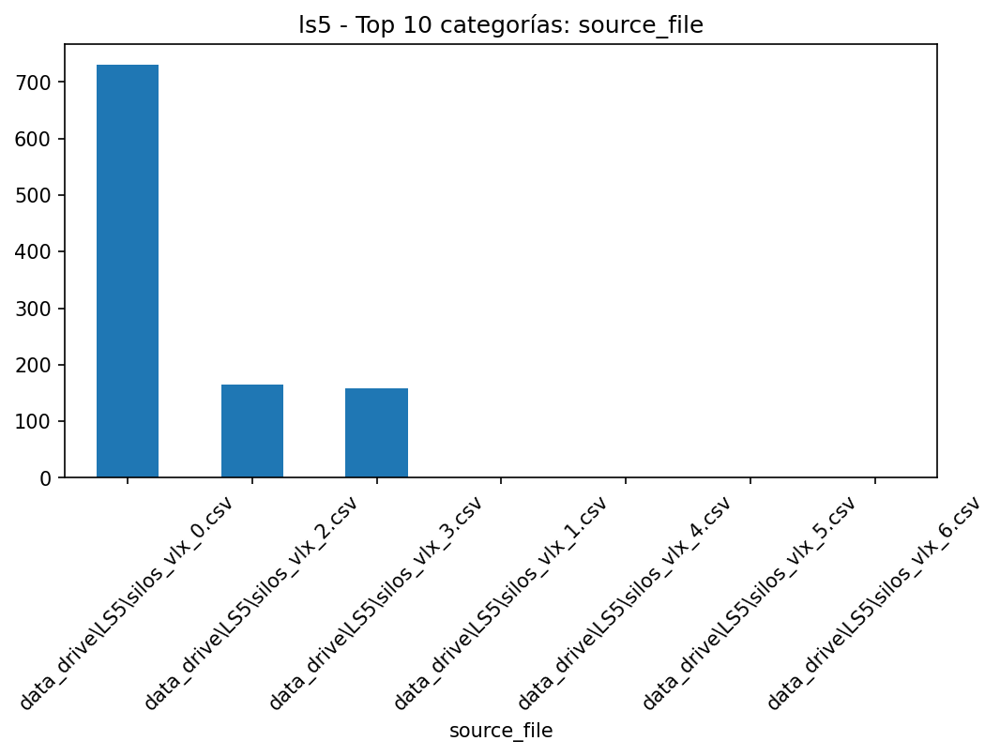
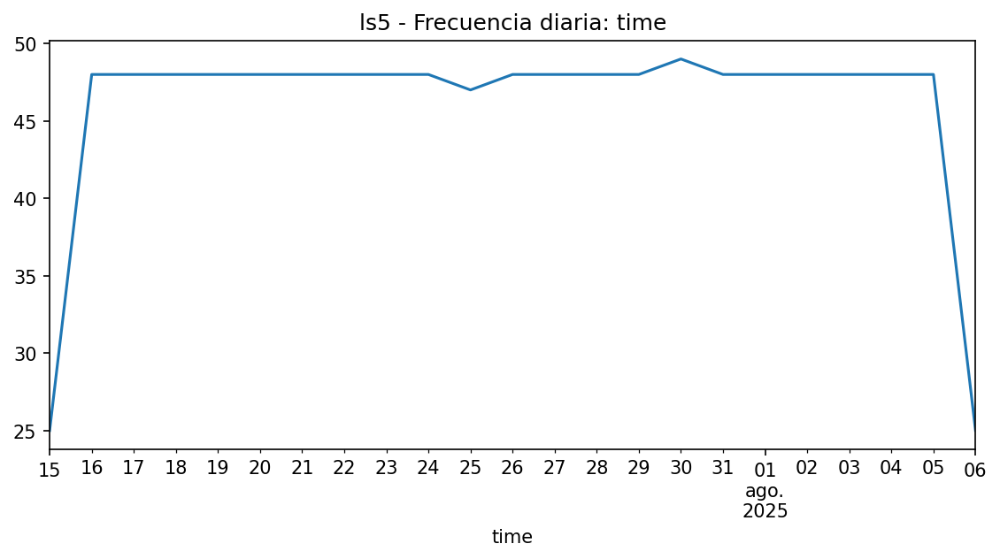

# EDA - ls5

## Resumen

- **Filas**: 1,058

- **Columnas**: 4

- **Memoria**: 167.51 KB (171,528 bytes)

- **Tipos de datos**: string: 2, datetime64[ns]: 1, Float64: 1

## Top columnas por % de nulos

|             |   nulls_pct |
|:------------|------------:|
| mac         |           0 |
| time        |           0 |
| vlx         |           0 |
| source_file |           0 |

## Top columnas por cardinalidad

|             |   unique_values |
|:------------|----------------:|
| time        |            1058 |
| vlx         |             237 |
| source_file |               7 |
| mac         |               1 |

## Resumen numérico extendido

|     |   count |    mean |     std |   min |   25% |   50% |   75% |   max |    skew |   kurtosis |   outliers_count |   outliers_pct |   low_fence |   high_fence |   iqr |
|:----|--------:|--------:|--------:|------:|------:|------:|------:|------:|--------:|-----------:|-----------------:|---------------:|------------:|-------------:|------:|
| vlx |    1058 | 307.549 | 69.7427 |   107 |   295 |   320 |   341 |   526 | -0.6108 |     0.3047 |              215 |        20.3214 |         226 |          410 |    46 |

## Gráficas

