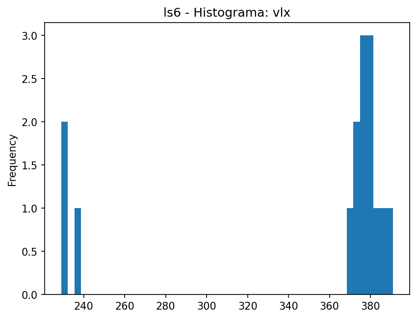
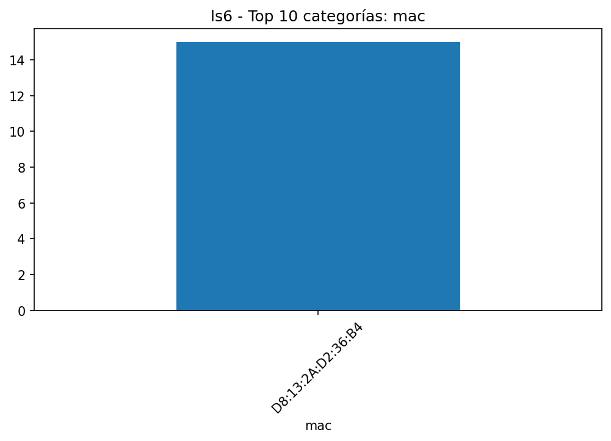
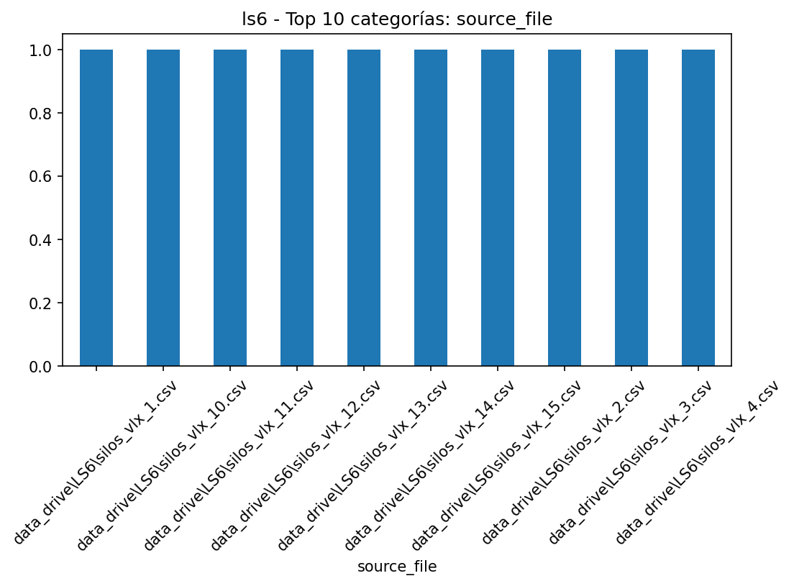
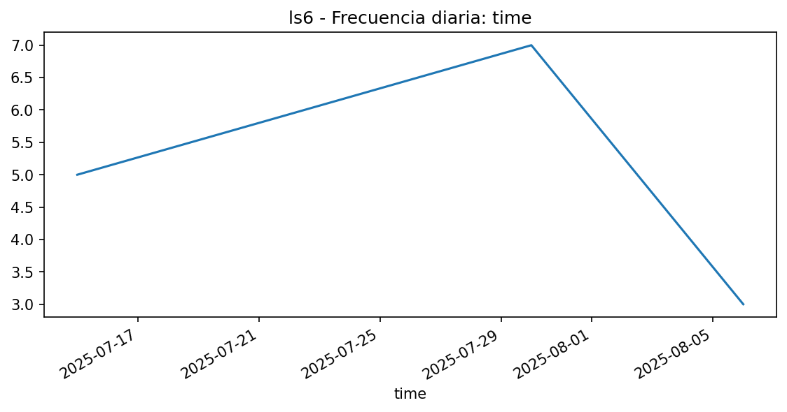

# EDA - ls6

## Resumen

- **Filas**: 15

- **Columnas**: 4

- **Memoria**: 2.51 KB (2,568 bytes)

- **Tipos de datos**: string: 2, datetime64[ns]: 1, Float64: 1

## Top columnas por % de nulos

|             |   nulls_pct |
|:------------|------------:|
| mac         |           0 |
| time        |           0 |
| vlx         |           0 |
| source_file |           0 |

## Top columnas por cardinalidad

|             |   unique_values |
|:------------|----------------:|
| time        |              15 |
| source_file |              15 |
| vlx         |              12 |
| mac         |               1 |

## Resumen numérico extendido

|     |   count |    mean |     std |   min |   25% |   50% |   75% |   max |    skew |   kurtosis |   outliers_count |   outliers_pct |   low_fence |   high_fence |   iqr |
|:----|--------:|--------:|--------:|------:|------:|------:|------:|------:|--------:|-----------:|-----------------:|---------------:|------------:|-------------:|------:|
| vlx |      15 | 349.933 | 61.4299 |   229 |   372 |   378 |   381 |   391 | -1.6463 |     0.8641 |                3 |             20 |       358.5 |        394.5 |     9 |

## Gráficas

